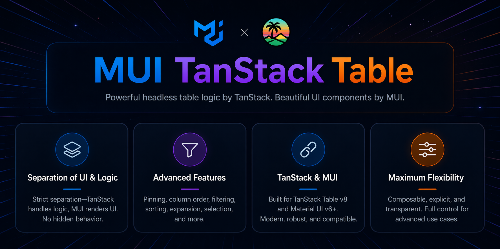

# 
# Welcome to MUI TanStack Table Workspaces

## Project Overview

This monorepo provides Material UI (MUI) render components for [TanStack Table](https://tanstack.com/table/v8), enabling seamless integration of TanStack Table's powerful state and logic with Material UI's design system. The goal is to offer a flexible, type-safe, and highly customizable set of MUI components that render TanStack Table data, while keeping all table state and business logic within TanStack Table itself.

## Project Structure

- **packages/mui-tanstack-table/**: Main package containing the MUI render components, utilities, and type extensions for TanStack Table. See the [mui-tanstack-table README](packages/mui-tanstack-table/README.md) for details.
- **packages/storybook/**: Storybook instance with interactive demos, usage examples, and documentation. View the latest docs and demos at [storybook docs](https://coderic-labs.github.io/mui-tanstack-table).
- **packages/cypress-tests/**: Cypress component tests for table behaviors, selectors, and UI flows.

## Documentation & Resources

- [Storybook Docs & Demos](https://coderic-labs.github.io/mui-tanstack-table)
- [TanStack Table React Docs](https://tanstack.com/table/v8/docs/react/overview)

## Contributing

Contributions are welcome! If you'd like to add features, fix bugs, or improve documentation, please open an issue or submit a pull request. See the package-level README for setup and development instructions.

---

**License:** MIT (see individual package for details)
